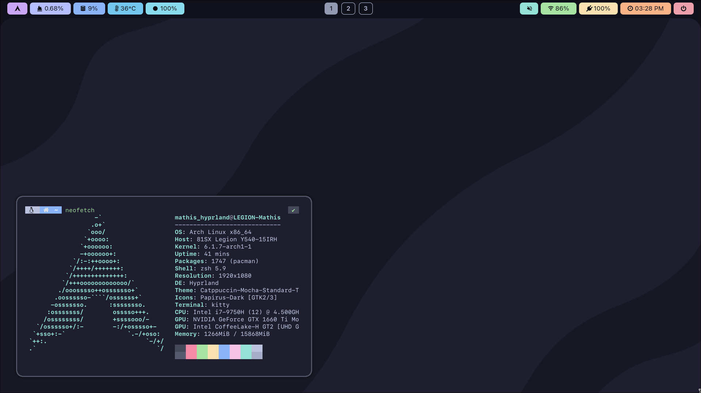
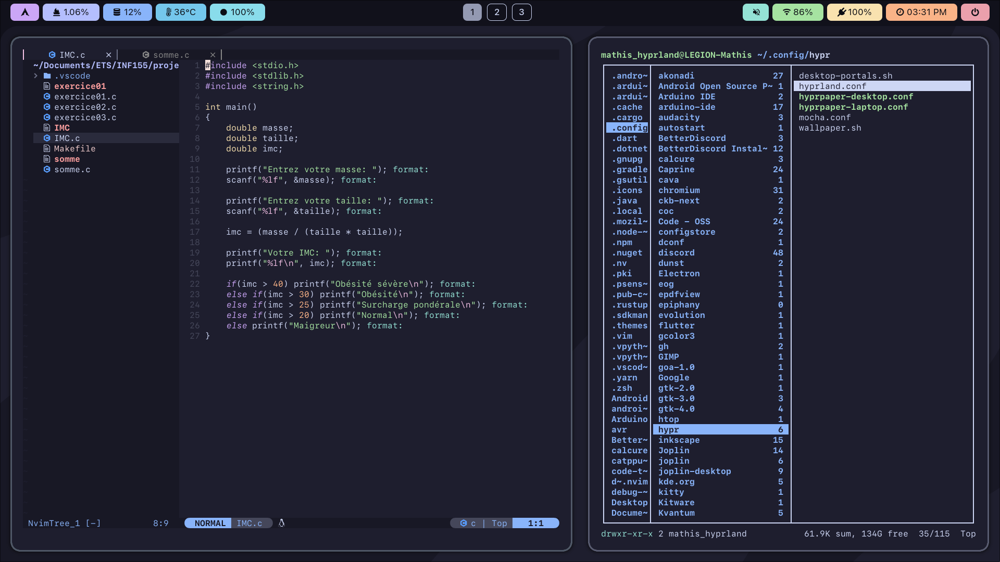
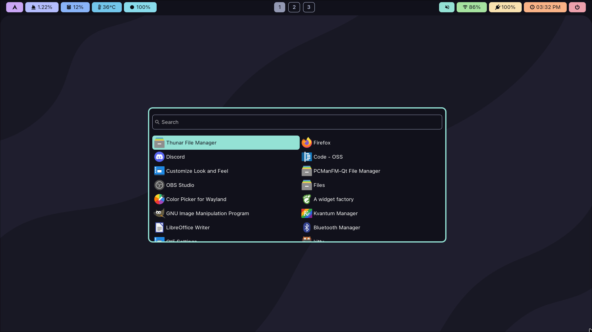
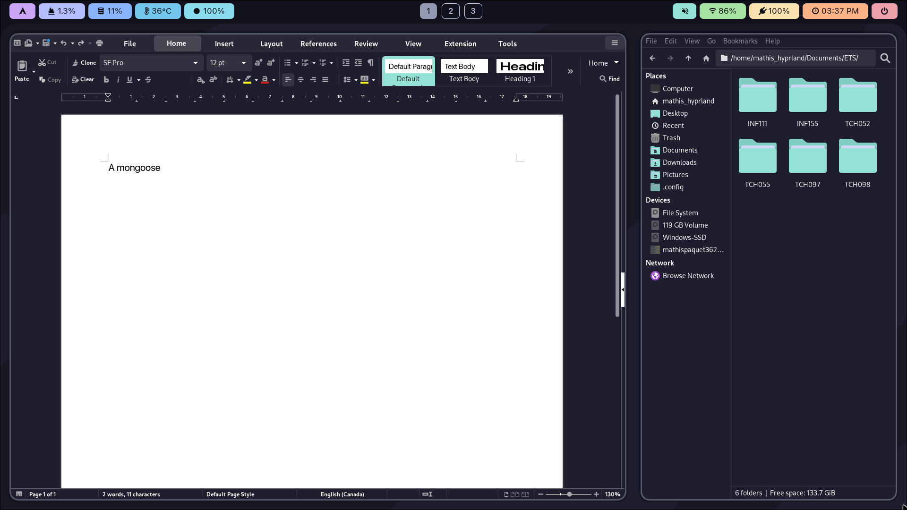
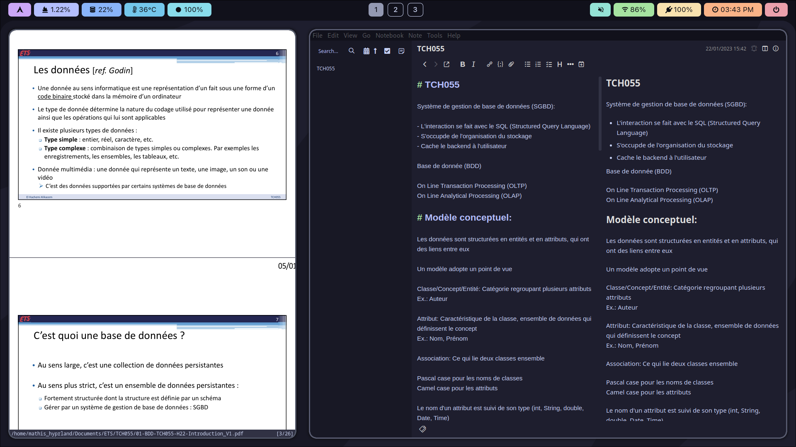

# hyppuccin
Catppuccin theme for Hyprland

* Compositor: Hyprland
* Terminal: Kitty
* Shell: zsh
* Color scheme (and all themes): Cattpuccin
* GUI file manager: Thunar
* TUI file manager: Ranger
* Bar: Waybar
* App launcher: Wofi
* Text editor: nvim
* Note taker: Joplin
* Cursor theme: Bibata modern classic
* PDF viewer: Zathura

